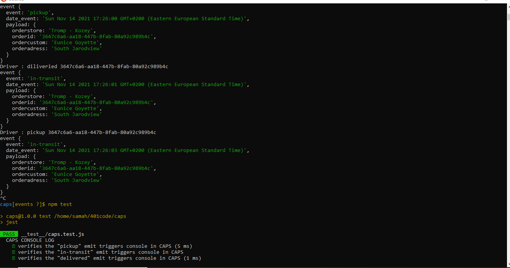
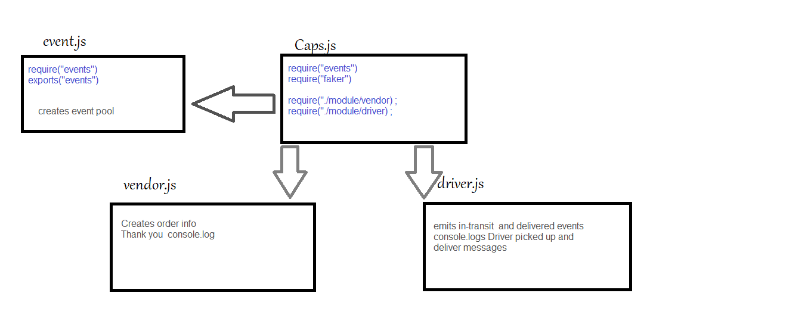

# Caps
## Author: Samah Hamed

### GitHub :  https://github.com/samahhamed227/caps  
### Start: 
```
npm start
```
# Tests
To run tests:
`npm test`

### Sample Output
```
event {
  event: 'pickup',
  date_event: 'Sun Nov 14 2021 17:25:55 GMT+0200 (Eastern European Standard Time)',
  payload: {
    orderstore: 'Moen and Sons',
    orderid: '1ab359a7-01a4-4d49-8b1d-ddfb8e452700',
    ordercustom: 'Kelly Sporer III',
    orderadress: 'Terryton'
  }
}
Driver : diliveried 1ab359a7-01a4-4d49-8b1d-ddfb8e452700
event {
  event: 'in-transit',
  date_event: 'Sun Nov 14 2021 17:25:56 GMT+0200 (Eastern European Standard Time)',
  payload: {
    orderstore: 'Moen and Sons',
    orderid: '1ab359a7-01a4-4d49-8b1d-ddfb8e452700',
    ordercustom: 'Kelly Sporer III',
    orderadress: 'Terryton'
  }
}
Driver : pickup 1ab359a7-01a4-4d49-8b1d-ddfb8e452700
event {
  event: 'in-transit',
  date_event: 'Sun Nov 14 2021 17:25:58 GMT+0200 (Eastern European Standard Time)',
  payload: {
    orderstore: 'Moen and Sons',
    orderid: '1ab359a7-01a4-4d49-8b1d-ddfb8e452700',
    ordercustom: 'Kelly Sporer III',
    orderadress: 'Terryton'
  }
}
Deprecation Warning: faker.random.uuid is now located in faker.datatype.uuid
event {
  event: 'pickup',
  date_event: 'Sun Nov 14 2021 17:26:00 GMT+0200 (Eastern European Standard Time)',
  payload: {
    orderstore: 'Tromp - Kozey',
    orderid: '3647c6a6-aa18-447b-8fab-80a92c989b4c',
    ordercustom: 'Eunice Goyette',
    orderadress: 'South Jarodview'
  }
} 
```
# UML
